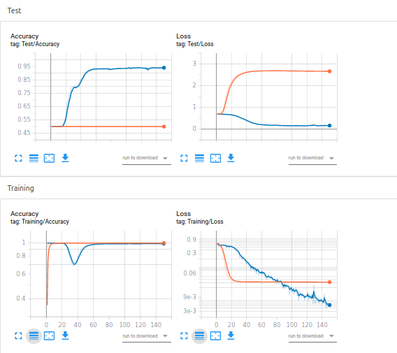

# Learning-to-Reweight-Examples-for-Robust-Deep-Learning-with-PyTorch-Higher
An implementation of https://arxiv.org/abs/1803.09050 with PyTorch and 'Higher' (https://github.com/facebookresearch/higher).

I was able to replicate the imbalanced MNIST experiment from the paper.

