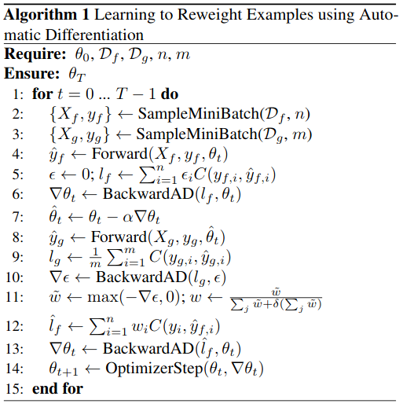

# Learning-to-Reweight-Examples-for-Robust-Deep-Learning-with-PyTorch-Higher
An implementation of the paper [Learning to Reweight Examples for Robust Deep Learning](https://arxiv.org/abs/1803.09050) from ICML 2018 with PyTorch and [Higher](https://github.com/facebookresearch/higher).
Core of the paper is the following algorithm.

I was able to replicate the imbalanced MNIST experiment from the paper.

Orange is baseline, blue is the method from paper.

